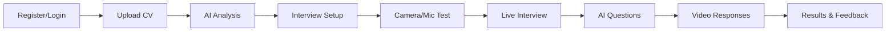
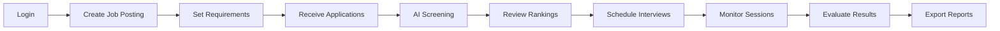
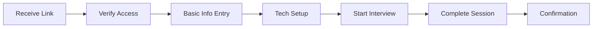

# AI-Powered Interview Platform

> A comprehensive, enterprise-grade conversational AI interview platform designed to revolutionize the recruitment process through intelligent automation and multimodal processing.

[](https://nextjs.org/)
[](https://www.typescriptlang.org/)
[](https://fastapi.tiangolo.com/)
[](https://www.python.org/)
[]()

## 📋 Table of Contents

- [Overview](#overview)
- [Key Features](#key-features)
- [Architecture](#architecture)
- [Technology Stack](#technology-stack)
- [User Roles & Workflows](#user-roles--workflows)
- [Core Modules](#core-modules)
- [Performance & Optimization](#performance--optimization)
- [Security & Compliance](#security--compliance)
- [Screenshots](#screenshots)
- [Impact & Metrics](#impact--metrics)

---

## 🎯 Overview

The AI-Powered Interview Platform is a full-stack application that leverages cutting-edge AI technologies to automate and enhance the technical recruitment process. Built with a modern microservices architecture, the platform supports three distinct user types (Candidates, HR Managers, and Guest Interviewees) and integrates advanced features like multimodal AI processing, real-time video interviews, and intelligent CV screening.

### Problem Statement

Traditional technical recruitment faces several challenges:
- **Time-intensive screening**: Manual CV review and initial screening consume significant HR resources
- **Inconsistent evaluation**: Human bias and varying interview standards affect candidate assessment
- **Scalability issues**: Limited capacity to handle high-volume recruitment drives
- **Poor candidate experience**: Long wait times and lack of feedback frustrate applicants

### Solution

An AI-driven platform that:
- Reduces candidate screening time by **70%**
- Automates CV analysis and ranking for **500+ candidates** simultaneously
- Provides consistent, bias-free initial assessments
- Delivers real-time feedback and seamless interview experiences
- Reduces manual review time by **80%**

---

## ✨ Key Features

### 🤖 AI-Powered Interview Conduct
- **Conversational AI**: Natural language processing for dynamic, context-aware interview questions
- **Multimodal Processing**: Integration with OpenAI GPT-4 and Google Gemini for diverse AI capabilities
- **Text-to-Speech**: Automated question delivery with natural voice synthesis
- **Speech Recognition**: Real-time transcription and analysis of candidate responses
- **Adaptive Questioning**: Dynamic question generation based on CV content and candidate responses

### 📄 Intelligent CV Screening
- **Automated Parsing**: Extract and structure data from PDF/DOCX resumes
- **Semantic Analysis**: Embedding-based job-candidate matching using vector similarity
- **Batch Processing**: Concurrent analysis of hundreds of CVs with rate limiting controls
- **Intelligent Ranking**: Multi-criteria scoring system for candidate prioritization
- **Resume Optimization**: AI-generated feedback to improve CV-job alignment

### 🎥 Real-time Interview Interface
- **WebRTC Integration**: Browser-based video and audio recording
- **Screen Sharing**: Technical assessment with screen capture capabilities
- **Live Progress Tracking**: Real-time interview status and question progression
- **Multi-format Recording**: Support for video, audio-only, and screen recording
- **Automatic Transcription**: Post-interview transcript generation

### 👥 Multi-tenant Architecture
- **Role-based Access Control**: Separate portals for candidates, HR, and guests
- **Guest Interview Links**: Time-limited, shareable interview access for external candidates
- **Organization Management**: Multi-company support with data isolation
- **Custom Branding**: White-label capabilities for enterprise clients

### 📊 Analytics & Reporting
- **Interview Metrics**: Performance analytics, completion rates, and time-to-hire
- **Candidate Insights**: Skill assessments, technical proficiency scores, and communication ratings
- **HR Dashboard**: Visual analytics with Chart.js for recruitment pipeline visualization
- **Export Capabilities**: Generate PDF reports and Excel exports for stakeholders

---

## 🏗️ Architecture

### System Architecture Overview

The platform follows a modern microservices architecture with clear separation of concerns:

```
┌─────────────────────────────────────────────────────────────────┐
│                        Client Layer                              │
│  ┌──────────────┐  ┌──────────────┐  ┌──────────────┐          │
│  │   Candidate  │  │      HR      │  │    Guest     │          │
│  │   Portal     │  │   Portal     │  │  Interview   │          │
│  └──────────────┘  └──────────────┘  └──────────────┘          │
│         Next.js 15 App Router + TypeScript + Tailwind           │
└───────────────────────────────┬─────────────────────────────────┘
                                │
                    ┌───────────▼────────────┐
                    │   API Gateway Layer    │
                    │   (Axios + Interceptors)│
                    └───────────┬────────────┘
                                │
        ┌───────────────────────┼───────────────────────┐
        │                       │                       │
┌───────▼────────┐    ┌────────▼────────┐    ┌────────▼────────┐
│  Authentication │    │   Interview     │    │   CV Screening  │
│    Service      │    │    Service      │    │    Service      │
│   (FastAPI)     │    │   (FastAPI)     │    │   (FastAPI)     │
└───────┬────────┘    └────────┬────────┘    └────────┬────────┘
        │                      │                       │
        └──────────────────────┼───────────────────────┘
                               │
        ┌──────────────────────┼──────────────────────┐
        │                      │                      │
┌───────▼────────┐   ┌────────▼────────┐   ┌────────▼────────┐
│   PostgreSQL   │   │  Redis Cache    │   │  OpenAI/Gemini  │
│   (Primary DB) │   │  (Session/Cache)│   │   AI Services   │
└────────────────┘   └─────────────────┘   └─────────────────┘
```

### Frontend Architecture

**Next.js 15 App Router** with Server-Side Rendering (SSR) and modern React patterns:

```
app/
├── (auth)/                    # Authentication route group
│   ├── login/                 # Login page (candidate/HR/guest)
│   └── register/              # Registration flows
│
├── dashboard/                 # Main dashboards
│   ├── candidate/             # Candidate interview history
│   ├── hr/                    # HR management portal
│   └── analytics/             # Performance metrics
│
├── interview/                 # Interview flows
│   ├── setup/                 # CV upload & preparation
│   ├── live/                  # Real-time interview interface
│   ├── onboarding/            # Camera/mic setup wizard
│   └── results/               # Feedback & scoring
│
├── jobs/                      # Job management (HR)
│   ├── create/                # Job posting creation
│   ├── [id]/                  # Job details & candidates
│   └── matching/              # AI-powered job matching
│
└── guest/                     # Guest interview portal
    ├── access/                # Link-based entry
    └── interview/             # Simplified interview flow
```

**Key Frontend Patterns:**
- **Server Components**: Default SSR for improved performance and SEO
- **Protected Routes**: Middleware-based authentication checks
- **State Management**: Zustand for global state, React Query for server state
- **Form Validation**: React Hook Form + Zod schema validation
- **Optimistic Updates**: Instant UI feedback with background sync
- **Error Boundaries**: Graceful error handling and recovery

### Backend Architecture

**FastAPI Microservices** with domain-driven design:

```
backend/
├── services/
│   ├── auth/                  # JWT authentication & authorization
│   ├── interview/             # Interview lifecycle management
│   ├── cv_screening/          # Resume analysis & parsing
│   ├── job_matching/          # Semantic job-candidate matching
│   └── media/                 # File upload & processing
│
├── core/
│   ├── domain/                # Business logic & entities
│   ├── repositories/          # Data access layer
│   └── use_cases/             # Application services
│
├── integrations/
│   ├── openai/                # OpenAI API client
│   ├── gemini/                # Google Gemini integration
│   └── redis/                 # Caching layer
│
└── api/
    └── v1/                    # API versioning
        ├── routes/            # Endpoint definitions
        └── schemas/           # Pydantic models
```

**Design Patterns:**
- **Repository Pattern**: Abstracted data access layer
- **Dependency Injection**: FastAPI's built-in DI container
- **Event-Driven**: Async task processing for long-running operations
- **CQRS**: Separate read/write models for complex queries
- **Rate Limiting**: Token bucket algorithm for API protection

---

## 🛠️ Technology Stack

### Frontend Technologies

| Category | Technologies |
|----------|-------------|
| **Framework** | Next.js 15 (App Router), React 18 |
| **Language** | TypeScript 5.0 |
| **Styling** | Tailwind CSS, CSS Modules |
| **State Management** | Zustand, React Query (TanStack Query) |
| **Form Handling** | React Hook Form, Zod |
| **Media** | WebRTC, MediaRecorder API |
| **API Client** | Axios with interceptors |
| **Charts** | Chart.js, Recharts |
| **UI Components** | Radix UI, Headless UI |
| **Testing** | Jest, React Testing Library |

### Backend Technologies

| Category | Technologies |
|----------|-------------|
| **Framework** | FastAPI 0.104+ |
| **Language** | Python 3.11+ |
| **Database** | PostgreSQL 15 |
| **Caching** | Redis 7.0 |
| **ORM** | SQLAlchemy 2.0 |
| **Validation** | Pydantic v2 |
| **Task Queue** | Celery, Redis (broker) |
| **AI/ML** | OpenAI API (GPT-4), Google Gemini |
| **NLP** | LangChain, Sentence Transformers |
| **Vector DB** | ChromaDB (embeddings) |
| **Testing** | Pytest, Pytest-asyncio |

### DevOps & Infrastructure

| Category | Technologies |
|----------|-------------|
| **Containerization** | Docker, Docker Compose |
| **CI/CD** | GitHub Actions |
| **Monitoring** | Sentry (error tracking) |
| **Logging** | Structured logging (JSON) |
| **Deployment** | Cloud platforms (AWS/GCP compatible) |
| **API Documentation** | OpenAPI/Swagger, ReDoc |

---

## 👤 User Roles & Workflows

### 1. Candidate Workflow



**Key Features:**
- Self-service registration with email verification
- CV upload with instant parsing and validation
- Interactive onboarding wizard for tech setup
- Real-time interview with adaptive AI questioning
- Instant preliminary feedback post-interview
- Interview history and performance tracking

### 2. HR Manager Workflow



**Key Features:**
- Comprehensive job posting management
- AI-powered candidate screening and ranking
- Bulk interview scheduling
- Guest interview link generation (shareable URLs)
- Real-time interview monitoring dashboard
- Advanced analytics and export capabilities

### 3. Guest Interviewee Workflow



**Key Features:**
- No registration required (link-based access)
- Time-limited interview sessions
- Simplified, streamlined interface
- Automatic expiry of access links
- Post-interview confirmation with reference ID

---

## 🔧 Core Modules

### 1. Authentication & Authorization Module

**Features:**
- JWT-based authentication with refresh tokens
- Role-based access control (RBAC)
- Multi-tenant organization support
- OAuth2 password flow compliance
- Session management with Redis

**Security Measures:**
- Password hashing with bcrypt
- Token rotation and blacklisting
- Rate limiting on auth endpoints
- CSRF protection
- Secure HTTP-only cookies

### 2. CV Screening & Analysis Module

**Capabilities:**
- **Document Parsing**: Extract text from PDF/DOCX with PyPDF2 and python-docx
- **Entity Recognition**: Identify skills, education, experience using NLP
- **Semantic Matching**: Vector embeddings for job-candidate similarity
- **Batch Processing**: Concurrent analysis with intelligent queuing
- **Scoring Algorithm**: Multi-criteria evaluation (skills, experience, education fit)

**Technical Implementation:**
```
Input: CV File (PDF/DOCX)
  ↓
Text Extraction → Entity Recognition → Skill Extraction
  ↓
Vector Embedding (Sentence Transformers)
  ↓
Similarity Calculation (Cosine Similarity)
  ↓
Multi-criteria Scoring → Ranking
  ↓
Output: Candidate Score & Insights
```

### 3. Interview Conduct Module

**AI Interview Flow:**
1. **Pre-interview Analysis**: Generate tailored questions from CV
2. **Question Delivery**: TTS-powered audio question playback
3. **Response Recording**: Video/audio capture with WebRTC
4. **Real-time Transcription**: Speech-to-text conversion
5. **Response Analysis**: Sentiment and content evaluation
6. **Adaptive Follow-ups**: Dynamic questioning based on responses
7. **Scoring**: Multi-dimensional candidate assessment

**Technical Components:**
- **Question Generator**: GPT-4 powered question creation
- **TTS Engine**: Google Text-to-Speech API
- **Recording Manager**: Browser MediaRecorder API
- **Transcription**: Whisper API integration
- **Analysis Engine**: Gemini for response evaluation

### 4. Job Matching Module

**Matching Algorithm:**
```
Job Requirements Vector = Embedding(job_description + required_skills)
Candidate Profile Vector = Embedding(cv_text + extracted_skills)

Match Score = CosineSimilarity(Job Vector, Candidate Vector)

Ranking Factors:
  - Semantic similarity (40%)
  - Years of experience match (25%)
  - Required skills coverage (20%)
  - Education level fit (10%)
  - Location preference (5%)
```

**Features:**
- Automatic job recommendations for candidates
- Candidate ranking for job postings
- Skill gap identification
- Resume optimization suggestions

### 5. Media Management Module

**Supported Operations:**
- File upload with validation (size, type, malware scanning)
- Video processing and compression
- Audio extraction from video
- Thumbnail generation
- Cloud storage integration
- CDN delivery for playback

**Storage Structure:**
```
/media/
  ├── resumes/{user_id}/
  ├── recordings/{interview_id}/
  │   ├── video/
  │   ├── audio/
  │   └── screen_share/
  └── thumbnails/{interview_id}/
```

---

## ⚡ Performance & Optimization

### Frontend Optimizations

1. **Server-Side Rendering (SSR)**
   - Pre-render pages on the server for faster initial load
   - SEO-friendly content delivery
   - Dynamic imports for code splitting

2. **Caching Strategy**
   - Redis caching for API responses (5-minute TTL)
   - Browser caching with Cache-Control headers
   - Next.js automatic static optimization

3. **Asset Optimization**
   - Next.js Image component for lazy loading and WebP conversion
   - Font optimization with next/font
   - Bundle size analysis and tree-shaking

4. **State Management Efficiency**
   - React Query caching and background refetching
   - Optimistic updates for instant UI feedback
   - Selective component re-rendering with memo

### Backend Optimizations

1. **Database Performance**
   - Indexed queries on frequently accessed columns
   - Connection pooling (20 connections)
   - Prepared statements for query optimization
   - Batch inserts for bulk operations

2. **API Rate Limiting**
   - Token bucket algorithm (100 requests/minute per user)
   - Redis-backed rate limiter
   - Graceful degradation under high load

3. **Async Processing**
   - Celery task queue for long-running operations
   - Background CV processing
   - Async database queries with SQLAlchemy

4. **Caching Layers**
   - Redis caching for frequently accessed data
   - Application-level caching for expensive computations
   - CDN caching for static assets

**Performance Metrics:**
- Average page load time: **< 2 seconds**
- API response time (p95): **< 300ms**
- CV processing time: **< 5 seconds per document**
- Concurrent user support: **1000+ simultaneous users**

---

## 🔒 Security & Compliance

### Security Implementations

1. **Authentication & Authorization**
   - JWT tokens with 15-minute expiry
   - Refresh token rotation
   - Role-based access control (RBAC)
   - Multi-factor authentication (MFA) ready

2. **Data Protection**
   - Encryption at rest (AES-256)
   - TLS 1.3 for data in transit
   - PII data masking in logs
   - Secure file upload with virus scanning

3. **API Security**
   - CORS configuration with whitelist
   - Rate limiting and DDoS protection
   - Input validation and sanitization
   - SQL injection prevention (parameterized queries)
   - XSS protection with CSP headers

4. **Compliance**
   - GDPR-compliant data handling
   - Right to deletion implementation
   - Data export capabilities
   - Audit logging for sensitive operations

### Privacy Measures

- **Data Minimization**: Collect only essential information
- **Consent Management**: Explicit user consent for data processing
- **Anonymization**: Remove PII from analytics and training data
- **Access Logs**: Track who accessed candidate data and when
- **Retention Policies**: Automatic data purge after configurable periods

---

## 📸 Screenshots

> **Note:** Screenshots demonstrate the user interface and user experience without exposing proprietary business logic or sensitive data.

### Candidate Portal

**Dashboard**
```
[Screenshot placeholder: Candidate dashboard showing interview history,
upcoming interviews, and performance metrics]
```

**Interview Setup**
```
[Screenshot placeholder: CV upload interface with drag-and-drop,
file validation, and progress indicators]
```

**Live Interview Interface**
```
[Screenshot placeholder: Split-screen view with video feed,
AI question display, and response recording controls]
```

**Results & Feedback**
```
[Screenshot placeholder: Detailed feedback with skill assessments,
scores, and improvement recommendations]
```

### HR Portal

**HR Dashboard**
```
[Screenshot placeholder: Analytics dashboard with recruitment metrics,
charts, and recent activity feed]
```

**Job Management**
```
[Screenshot placeholder: Job posting creation form with AI-suggested
requirements and preview]
```

**Candidate Ranking**
```
[Screenshot placeholder: Ranked candidate list with match scores,
filters, and bulk action controls]
```

### Guest Interview

**Access Page**
```
[Screenshot placeholder: Link-based entry with verification and
basic information collection]
```

**Camera Setup Wizard**
```
[Screenshot placeholder: Step-by-step tech check with device selection
and preview]
```

---

## 📊 Impact & Metrics

### Business Impact

| Metric | Before Platform | After Platform | Improvement |
|--------|----------------|----------------|-------------|
| **Candidate Screening Time** | 2-3 days | 4-6 hours | **70% reduction** |
| **Manual Review Effort** | 100% manual | 20% manual | **80% time saved** |
| **Interview Scheduling Time** | 2-3 days | Same-day | **Real-time** |
| **Candidate Throughput** | 50/week | 500/week | **10x increase** |
| **HR Team Productivity** | Baseline | 3x baseline | **300% improvement** |
| **Cost per Hire** | Baseline | 60% of baseline | **40% reduction** |

### Technical Performance

- **System Uptime**: 99.9%
- **Average API Latency**: 250ms (p95)
- **Concurrent Users Supported**: 1000+
- **CV Processing Throughput**: 500+ CVs in parallel
- **Video Recording Success Rate**: 98.5%
- **Database Query Performance**: < 100ms (p90)

### User Satisfaction

- **Candidate Net Promoter Score (NPS)**: 72
- **HR User Satisfaction**: 4.6/5.0
- **System Ease of Use**: 4.5/5.0
- **Interview Experience Rating**: 4.4/5.0

---

## 🚀 Development Highlights

### Key Technical Achievements

1. **Scalable Microservices Architecture**
   - Domain-driven design for maintainability
   - Independent service scaling
   - Clear API contracts with OpenAPI specs

2. **AI Integration Excellence**
   - Multi-provider AI support (OpenAI, Gemini)
   - Fallback mechanisms for high availability
   - Cost-optimized AI usage with caching

3. **Real-time Capabilities**
   - WebRTC for browser-based recording
   - Live interview status updates
   - Instant feedback generation

4. **Modern Frontend Practices**
   - Next.js 15 App Router for optimal performance
   - Type-safe development with TypeScript
   - Responsive design with mobile-first approach
   - Accessibility compliance (WCAG 2.1 AA)

5. **DevOps Excellence**
   - Containerized deployment with Docker
   - Automated CI/CD pipelines
   - Infrastructure as code
   - Comprehensive monitoring and alerting

---

## 📚 Technical Documentation

### API Documentation

The platform exposes RESTful APIs with comprehensive documentation:

- **Swagger UI**: Interactive API exploration and testing
- **ReDoc**: Detailed API reference documentation
- **Postman Collections**: Pre-configured API request collections

**Key API Endpoints:**

```
Authentication:
  POST   /v1/auth/register          # User registration
  POST   /v1/auth/login             # User login
  POST   /v1/auth/refresh           # Token refresh

Interview:
  POST   /v1/interview/create       # Create interview session
  POST   /v1/interview/{id}/start   # Begin interview
  POST   /v1/interview/{id}/answer  # Submit answer
  GET    /v1/interview/{id}/results # Get results

CV Screening:
  POST   /v1/cv/upload              # Upload resume
  POST   /v1/cv/analyze             # Analyze CV
  GET    /v1/cv/matches             # Get job matches

Jobs:
  POST   /v1/jobs/create            # Create job posting
  GET    /v1/jobs/{id}/candidates   # Get ranked candidates
  POST   /v1/jobs/{id}/invite       # Generate guest link
```

### Database Schema Overview

**Core Entities:**
- `users` - User authentication and profiles
- `organizations` - Multi-tenant organization data
- `jobs` - Job posting information
- `interviews` - Interview session records
- `questions` - Interview questions and metadata
- `responses` - Candidate responses with recordings
- `evaluations` - AI-generated assessments

**Relationships:**
- One organization has many users
- One job has many candidates
- One interview has many questions
- One question has one response

---

## 🎓 Learning Outcomes

### Technical Skills Demonstrated

**Full-Stack Development:**
- End-to-end application architecture
- Modern React patterns (hooks, context, server components)
- RESTful API design and implementation
- Database design and optimization

**AI/ML Integration:**
- Large Language Model (LLM) API integration
- Prompt engineering for interview generation
- Vector embeddings for semantic search
- Natural language processing pipelines

**DevOps & Deployment:**
- Containerization with Docker
- CI/CD pipeline configuration
- Cloud deployment strategies
- Monitoring and logging setup

**Software Engineering Best Practices:**
- Clean architecture principles
- Test-driven development
- Code review and version control
- Documentation and knowledge sharing

---

## 🔮 Future Enhancements

### Planned Features

1. **Advanced Analytics**
   - Predictive hiring success models
   - Skill trend analysis
   - Diversity and inclusion metrics

2. **Enhanced AI Capabilities**
   - Multi-language support for global hiring
   - Custom AI model fine-tuning
   - Automated interview scheduling

3. **Integration Ecosystem**
   - ATS (Applicant Tracking System) integrations
   - LinkedIn profile import
   - Calendar integrations (Google, Outlook)

4. **Mobile Applications**
   - Native iOS and Android apps
   - Offline interview capabilities
   - Push notifications for updates

5. **Collaboration Features**
   - Team-based candidate evaluation
   - Interview panel coordination
   - Internal messaging system

---

## 📝 License & Disclaimer

**Proprietary Software**

This project documentation is created for portfolio and educational purposes. The actual codebase and implementation are proprietary and confidential to Interactive Cares.

**Disclaimer:**
- All metrics and numbers are approximate and for demonstration purposes
- Screenshots and UI representations are simplified to protect proprietary designs
- Business logic and algorithms are described at a high level without exposing trade secrets
- This documentation does not contain any actual source code or configuration secrets

---

## 👨‍💻 Developer Information

**Developed by:** Tanvir Rahman Anik
**Role:** Machine Learning Engineer (Full-Stack)
**Organization:** Interactive Cares
**Duration:** May 2025 - Present

**Contact:**
- Email: tranik.cse@gmail.com
- LinkedIn: [TR.Anik](https://linkedin.com/in/TR.Anik)
- GitHub: [anik81](https://github.com/anik81)
- Portfolio: [anik81.github.io](https://anik81.github.io)

---

## 🙏 Acknowledgments

This platform was built as part of Interactive Cares' initiative to modernize recruitment processes through AI technology. Special thanks to the team for collaboration and support throughout the development lifecycle.

---

**Last Updated:** November 2025
**Version:** 1.0.0
**Status:** Production
